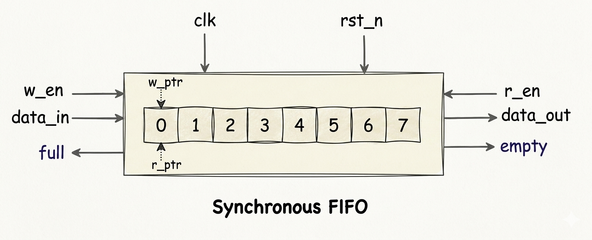

# RTL-to-GDS-Synchronous-FIFO-ASIC

A complete RTL-to-GDSII implementation of a parameterized synchronous FIFO (First-In-First-Out) buffer using the Cadence ASIC design toolchain. This project demonstrates the full digital ASIC design flow from Verilog RTL design and functional verification to synthesis, physical design, and final GDSII generation.

---

# Project Overview

This project implements a parameterized synchronous FIFO that supports configurable data width and depth. The FIFO enables safe and ordered data transfer between modules operating under the same clock domain.

The design includes robust handling of boundary conditions such as full, empty, overflow prevention, and simultaneous read/write operations.

The project covers the complete ASIC design cycle including:

RTL design using synthesizable Verilog
Functional verification using simulation
Constraint definition using SDC
Logic synthesis and optimization
Physical design and layout generation
Timing closure and GDSII export

---


## System Architecture

### Tools Used:

Cadence Incisive – Functional Verification

Cadence Genus – Logic Synthesis

Cadence Innovus – Physical Design

---

**RTL Design** → **Functional Verification** → **SDC Constraints** → **Synthesis** → **Physical Design** → **Clock Tree Synthesis** → **Routing** → **GDSII Generation**

---

<h2 align="center">System Block Diagram</h2>

<p align="center">
  
</p>

---

## Synchronous FIFO Design

The FIFO operates using a single clock domain and ensures ordered data storage and retrieval.

Functional Characteristics

Parameterized data width and depth

FIFO memory-based storage

Independent read and write control signals

Full and Empty status flags

Simultaneous read/write support

Circular buffer implementation

Synchronous operation with clock

Safe handling of overflow and underflow conditions

---

## Key Design Concepts

This project demonstrates core concepts essential to digital and ASIC design.

### Synchronous Sequential Logic

All FIFO operations are synchronized to a single clock edge, ensuring predictable timing and reliable operation.

### Circular Buffer Architecture

The FIFO is implemented using a circular memory structure with wrap-around pointer logic, enabling efficient utilization of memory.

### Pointer-Based Control Logic

Separate read and write pointers track memory access locations. Proper wrap-around logic ensures compatibility with arbitrary FIFO depths.

### Full and Empty Detection

The design uses a counter-based approach to determine FIFO status:

FIFO Full → when number of stored elements equals depth
FIFO Empty → when no data is present

### Simultaneous Read/Write Handling

The FIFO supports concurrent read and write operations without data corruption. Special logic allows writes even when full if a read occurs in the same cycle, improving throughput.

### Data Integrity and Flow Control

Careful gating of read/write enables ensures:

No overflow when FIFO is full
No underflow when FIFO is empty
Correct sequencing of data

### Static Timing Analysis (STA)

SDC constraints ensure that setup and hold requirements are satisfied across all timing paths, enabling reliable high-speed operation.


---

## Folder Structure

```text
├── rtl/
│   └── counter.v
│
├── testbench/
│   └── counter_test.v
│
├── constraints/
│   └── constraints_sdc.sdc
│
├── scripts/
│   └── rcscript.tcl
│
├── gds/
│   └── counter.gds
│
├── results/
│   └── images/
│
└── README.md
```
---
## Detailed Design Flow
### 1️⃣ RTL Design

File: fifo_sync.v

Synthesizable parameterized FIFO design

Circular buffer memory implementation

Read/Write pointer logic with wrap-around

Full/Empty detection using counter

---

### 2️⃣ Functional Verification

File: fifo_tb.v

Verification of:

Write operations

Read operations

FIFO full condition

FIFO empty condition

Simultaneous read/write

Overflow and underflow protection

Self-checking testbench using reference model

Waveform validation

---

### 3️⃣ Timing Constraints

File: fifo_constraints.sdc

Clock definition using create_clock

Input/output delay modeling

Timing environment setup

Enables Static Timing Analysis

---

### 4️⃣ Logic Synthesis

RTL → Gate-level netlist

Technology mapping using standard cells

Area, timing, and power optimization

Report generation (timing, area, power)

---

### 5️⃣ Physical Design Flow

Implemented in Cadence Innovus

Using:

Netlist from Genus

SDC constraints

RC script (rcscript.tcl)

Physical Design Steps Performed

Floorplanning

Power planning

Standard cell placement

Clock Tree Synthesis (CTS)

Routing

Timing closure

GDSII generation

---

### 7️⃣ Final Layout & GDS

File: fifo.gds

Final routed layout

DRC-clean implementation

Fabrication-ready design database

---

## Concepts Learned & Demonstrated

This project demonstrates:

FIFO architecture design

Synchronous digital system design

Pointer-based memory management

Static Timing Analysis (STA)

Setup and hold timing closure

Clock Tree Synthesis

Placement and routing strategies

Constraint-driven synthesis

ASIC design flow automation using TCL

---

## Applications of Synchronous FIFO

FIFOs are widely used in digital systems for buffering and data synchronization.

Typical applications include:

Inter-module data buffering

Pipeline architectures

Communication interfaces (UART, SPI, AXI)

Data streaming systems

Network packet buffering

DMA and memory controllers

---

## Future Enhancements

Possible extensions to the project include:

Asynchronous FIFO design (multi-clock domain)

Gray code pointer implementation

Almost full / almost empty flags

Error detection and status flags

Clock gating for power optimization

Multi-corner multi-mode (MCMM) analysis

Integration into SoC subsystems

---

### ASIC Flow Enhancements

Power optimization techniques

Formal verification integration

Advanced timing closure strategies

Low-power design methodologies

---

## Key features

Parameterized FIFO design

Robust full/empty handling

Safe simultaneous read/write

Synthesizable Verilog RTL

Self-checking testbench

Constraint-driven synthesis

Complete RTL-to-GDS flow

Physical layout generation

## Engineering Challenges & Solutions

Handling simultaneous read/write conditions

Ensuring pointer wrap-around for arbitrary depth

Preventing overflow and underflow

Timing violations during synthesis

Routing congestion

## Solutions Applied

Improved control logic for concurrent operations

Explicit pointer wrap-around implementation

Careful enable signal gating

Optimized SDC constraints

Timing-driven placement and routing

---

## Tech Stack


---

## Project Impact

This project demonstrates strong understanding of:

FIFO design and verification

ASIC design methodology

Timing-driven digital design

Physical implementation flow

Industry-relevant design practices

---


